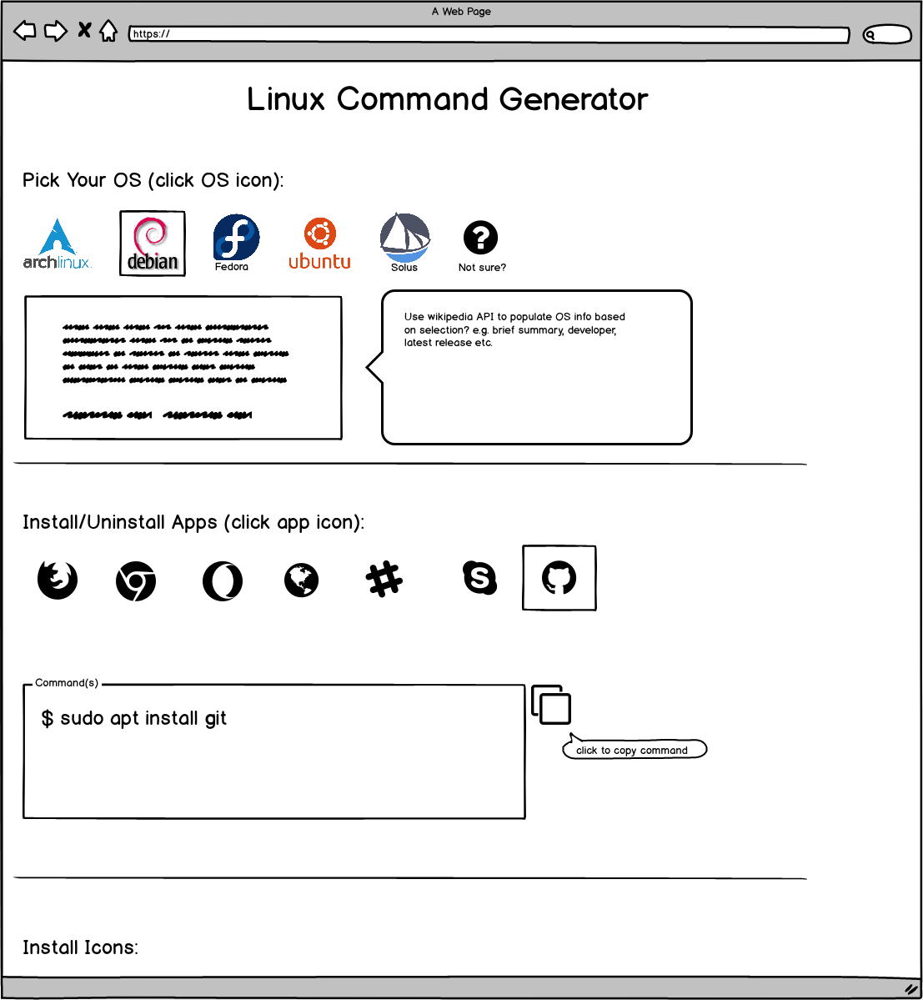
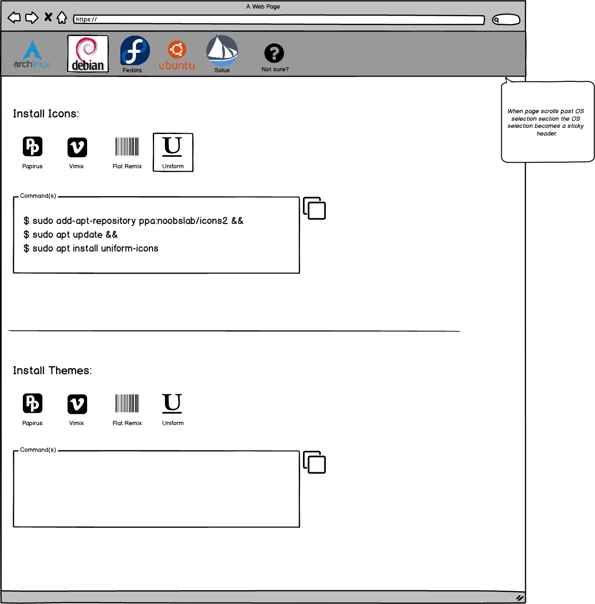
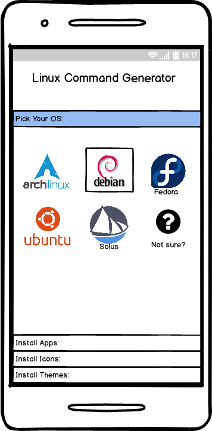
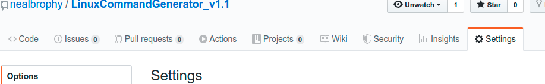
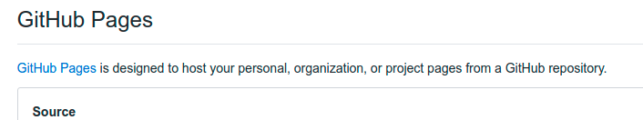
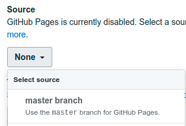

# Linux Command Generator
## Code Institute Milestone Project 2: Interactive Front End Development

### What is it?

A web app where users can get app, theme, and icon-pack installation commands for a variety of Linux distributions. The current selection is limited to distros I personally use regularly but I would like to expand in the future.

---
### Demo
You can view the GitHub pages deployment [here](https://nealbrophy.github.io/LinuxCommandGenerator_v1.1/)

---

### UX
The site is intended to be above all else, clean and simple. It was developed mobile first and should be easy & pleasant to use regardless of user device. I deliberately wanted to avoid navbars and multi-page linking to keep the site as simple to use and navigate as possible. The colour scheme is and fonts should suggest a 1950s retro style as I wanted bold, bright, and vibrant (bordering on gaudy) look.

#### User Stories
- As a Linux user I would like a simple repository of useful commands which is easy to navigate and understand.
- As a lay user the commands and instructions should be clear and easily followed.
- As a power user I want to be able to easily copy specific commands to achieve my goal of installing an app/icons/themes

#### Strategy
The command generator concept occurred to me when I was trying to think of a project which I personally would find useful and which got me excited. As someone who frequently "distro hops" to try out different Linux distros I often have to spend time googling commands to install apps/icons/themes I regularly use because there are too many to memorize. I wanted a site that could be quickly & easily used to retrieve such commands and which I could expand in the future to include more Linux distros and obviously more apps/icons/themes.

Eventually I would like to update the site so that rather than downloading a HTML file of the commands, users can download a install script to run on the specified distro. My knowledge of bash & shell scripts is not yet good enough to achieve this so the HTML download was a middle-ground. I would also like to impliment an "Email Commands" functionality so that users can email themselves the list of individual commands they need.

#### Scope
The goal of the app is to deliver specific linux commands quickly and simply, and to present them in a manner which is easy to copy & paste or download. To that end, features which may require an additional page, for example a "contact" page or "bug-report" page, were determined to be outside of the scope of this project. Likewise, a section containing summary/biographical type information about each distro was initially considered but as the intended audience would be existing linux users this was determined to be unnecessary info and thus out of scope.

#### Skeleton
##### Wireframes

#### Surface
The colour scheme and fonts are intended to suggest a retro 1950s style with the main title an eye catching "diner-name-at-top-of-menu" style. The two stylized fonts I chose for the page,([Major Mono Display](https://fonts.google.com/specimen/Major+Mono+Display) and [Monofett](https://fonts.google.com/specimen/Monofett)), had the desired feel but were too "busy" for use in the smaller text of the buttons/instructions. So I instead used them for the section titles. Monofett deliberately chosen for the output section as the thick black outline paired nicely with the black of the code-output area suggesting a relationship and the font harks back to old keyboard keys or screen output on a classic PC.

I wanted the distro buttons to have a bright colour so they would really stand-out and suggest that they're the main point of interest. Likewise I wanted the same effect for the sidebar-trigger button once items had been added to the list. Matching that colour again on the "Add to List" button was intended to suggest a relationship between those two functions (i.e. the bright Add to List button transmits it's colour to the trigger button when clicked and then the Clear List button removes that colour when clicked).

### Features
The site is intentionally easy to navigate to avoid needing a navbar or page links. Clicking on a button should immediately take the user to the next step in the process. Materialize.CSS was used to make the site responsive and to enable the pleasant "flat" style design elements to keep things easy on the eyes.

### Features to implement in the future
- "Email Command to Me" function so users can email the command(s) they need to themselves
- "Report bug" feature for users to report if/when a command stops functioning and needs to be revisited
- A simple interface for adding more distros/apps/icons/themes which doesn't require manually adding to the distros script

#### Deployment
LinuxCommandGenerator was developed using [Visual Studio Code](https://code.visualstudio.com/) and [GitKraken](https://www.gitkraken.com/). It is hosted on GitHub pages and deployed from the master branch. Any changes committed to the master branch will automatically update on the GitHub deployment.

The project was deployed to GitHub pages by:
- Navigating to the repo page [here](https://github.com/nealbrophy/LinuxCommandGenerator_v1.1)
- Clicking on the [settings tab](https://github.com/nealbrophy/LinuxCommandGenerator_v1.1/settings)

- Scrolling down to the "GitHub Pages" section

- Clicking on the dropdown under "Source" and selecting "master branch"

To make a local copy of the repo on your machine:
- Create a folder in the desired location on your computer.
- Open a terminal ([Mac instructions](https://macpaw.com/how-to/use-terminal-on-mac)|[Windows instructions](https://www.quora.com/How-do-I-open-terminal-in-windows)|[Linux instructions](https://www.howtogeek.com/howto/22283/four-ways-to-get-instant-access-to-a-terminal-in-linux/))
- Navigate to the folder you created using `cd` command in terminal (e.g. `cd ~/Documents/LinuxCommandGenerator`)
- Type `git init`
- Next type `git clone https://github.com/nealbrophy/LinuxCommandGenerator`
- To break the link between your local copy and the repo at https://github.com/nealbrophy/LinuxCommandGenerator type `git remote rm origin`

To run the app locally you can:
- Double click the "index.html" file in the root directory where you cloned the repo
- Use a Visual Studio Code add-on such as [Ritwick Dey's Live Server](https://marketplace.visualstudio.com/items?itemName=ritwickdey.LiveServer) to spin run the app on a local webserver
- If you have Node.js installed you can navigate to the root folder where you cloned the repo, enter `npm install http-server` in terminal, then enter `npx http-server`.

---
### How do I use it?
- 1.) Select the name of the appropriate Linux distro.
- 2.) Select the name of the app, theme, or icon-pack you want to install.
- 3.) See the CLI commands in the output section.
- 4.) Copy to clipboard and paste into your terminal (all of these commands require super user permissions, please make sure you have this before proceeding).
- 5.) If you would like to collect multiple app/theme/icon commands, simply click the "add to list/save for later" button then continue collecting more commands as needed.
- 6.) When you have collected all the commands you need (see Step 5 above) you can download them as a nicely formatted .html file.

---
#### Technologies used
- [EmailJS](https://www.emailjs.com/)
- [FileSaver.js](https://github.com/eligrey/FileSaver.js/)
- [FontAwesome](https://fontawesome.com/)
- [font-logos](https://github.com/lukas-w/font-logos)
- [Materialize](https://materializecss.com/)
- [Cypress.io](https://www.cypress.io/)
- [Google Fonts](https://fonts.google.com/)

---
### Testing

#### Automated End-to-End
The project was NOT developed using TDD practices as I was not yet comfortable enough with my JS knowledge to do so. Instead I opted for end-to-end testing using Cypress.io. The tests were written to validate:
- That the page loads correctly
- That the default/start state is blank and the output & list areas were empty
- That each distro behaves as expected such that the `ouput` and `instructions` elements populate expected contents
- That the `sidebar` element was hidden until it's trigger-button is clicked
- That the "download as file" button successfully downloads a file with the name "linux-commands.html"

##### How to run Cypress tests
- First clone the repo as discribed [above](#deployment).
- Next make sure you have nodeJS installed (to check you can enter `node -v` in a terminal window, if you get a version number then it's already installed)
- if not [install it](https://nodejs.org/en/)
- Open Visual Studio Code and open a terminal (`Ctrl+Shift+[backtick]`)
- Make sure you're in the root directory of the repo (if not use the `cd` command in terminal to navigate there)
- In terminal type `npm init` and fill out the fields as desired
- In terminal type `npm install cypress --save-dev`
- Once the install process finishes, launch Cypress by typing `npx cypress run` (if you run into problems [check the documentation](https://docs.cypress.io/guides/guides/command-line.html#Installation))
- When the Cypress GUI launches simply click on the name of the test script `commandGeneratorTests.spec.js` and the tests will run
- The test scipt can be found in `Cypress > Integration` folder within the root directory

#### Manual testing
In addition to the automated end-to-end tests described above the site was also rigourously tested via simple user interaction. These tests were carried out using Firefox and Chrome on a variety of Linux distributions (Elementary, Endeavour, Ubuntu, Solus) and using the in-browser developer tools. The following items were tested:
- Clicking app/icon/theme buttons prior to Distro button should present a message in the output section advising user to select a distri
- Apps/Icons/Themes which are not available for selected distro should appear as disabled/inactive
- Clicking "Copy" and "Add to list" buttons before making a valid selection should present the user with a warning message of same
- Sidebar trigger should only pulse when items are in the list and stop when the list is cleared
- Clicking "Add to List" button after selecting a NEW distro (i.e. having previously selected a distro & app) but BEFORE selecting an app for the new distro. 
- Clicking "Download as file" after user has cleared the list should notify user that the list is empty.

#### Validation
- HTML was validated using [W3C Markup Validation Service](https://validator.w3.org/)
- CSS was validated using [W3C CSS Validation Service](https://jigsaw.w3.org/css-validator/)
- Colours checked for WCAG validity using [Contrast Checker](https://contrastchecker.com/)
- JS was validated using [JSHint](https://jshint.com/)

#### Open Bugs:
- Copy text button presents "Copy unsuccessful" toast during cypress test but present "Copy successful" in manual testing.
- Having `scroll-behavior: smooth` enabled in the stylesheet causes some Cypress tests to fail.

#### Squashed Bugs: 
- If "Add To List" button was clicked after an OS had been selected but before an app had been selected the addToList function would run and add an "undefined" item to the list which would in turn be added to the sidebar and output to file.
    - __FIX__: Add if statment to prevent addToList from running unless both distro and app/icon/theme selections had been populated and present warning msg to user if not.
- If "Add To List" button was clicked after after an app had previously been added and after a new distro had been selected bbut before a an app for the newly selected distro has been selected the previously added app would populate even though user hadn't selected it for the new distro choice.
    - __FIX__: Reset "selection" variable to undefined every time a distro choice button is clicked.    
- Clicking "Copy Code" button before anything had been selected would present confirmation that copy was successful but there was nothing to copy.
    - __FIX__: Add if statement to check that distro and app/icon/theme selection had both been made. If not, present msg saying nothing to copy.
- Clicking "Download File" button would execute as expected but if user then opened sidebar and clicked "Download" button the same file would download even though no items were present in the saved list.
    - __FIX__: Added final action after Download File listener executes to overwrite the dataOuput variable with an empty string.
- Copy Code functionality didn't work for the code from notSure selection. Having this ability for other code but not the code to determine which OS user is running seemed counterproductive and not great UX.
    - __FIX__: Refactored commandGenerator script to accept notSure as valid choice for the purposes of running the copyToClipBoard and downloadFile functions. Achieved by moving the if statement (to validate distro/app selection) from within the copyToClipboard & downloadFile functions to within the click-listener "Add to List" button listener (that way statement is evaluated prior to calling addToList function and doesn't interfere with copyToClipboard/downloadFile).
- Clicking "Clear List" button would remove selections from the sidebar but NOT from the `dataOutput` variable which resulted in previously cleared entries still being downloaded despite not being in the current sidebar.
    - __FIX__: added `sideOutput = ''` to `clearSidebar` function

---
### Credits/Acknowledgements

#### Wirefreams created using:
[Balsamiq](https://balsamiq.com/)

#### Frameworks
- This site uses the [Materialize.CSS](https://materializecss.com/) framework.
- [This video](https://www.youtube.com/watch?v=4kN5lW4PNEs) from [TheNetNinja](https://www.youtube.com/channel/UCW5YeuERMmlnqo4oq8vwUpg) was helpful in implementing the Materialize Tabs functionality.

#### Installation instructions written/compiled with help from:
- [All Techs Tricks](https://alltechstricks.blogspot.com/)
- [LinuxBabe](https://www.linuxbabe.com/)
- [FOSSLinux](https://www.fosslinux.com/)
- [TecRobust](https://www.tecrobust.com/)
- [ItsUbuntu](https://itsubuntu.com/)
- [DraSite](https://drasite.com/)
- [LinuxHint](https://linuxhint.com)
- [AddictiveTips](https://www.addictivetips.com/)
- [OSRadar](https://www.osradar.com/)
- [ArchLinux Wiki](https://wiki.archlinux.org/)
- [Elementary OS]() forums
- [Solus]() forums
- [ScottLinux](https://scottlinux.com/)

#### Copy to Clipboard implementation from:
- [Dean Taylor's](https://stackoverflow.com/users/406712/dean-taylor) excellent answer on [StackOverflow](https://stackoverflow.com/questions/400212/how-do-i-copy-to-the-clipboard-in-javascript)

#### Download as file functionality uses:
- [FileSaver.js](https://github.com/eligrey/FileSaver.js/)

#### Icons:
- Arch, Debian, Elementary, and Ubuntu logo icons from [font-logos by lukas-w](https://github.com/lukas-w/font-logos)
- App icons from [FontAwesome](https://fontawesome.com/)

### Tux favicon
- Tux icon from [Favicon.cc](https://www.favicon.cc/?action=icon&file_id=899032)

#### Site look/style inspired by:
Cake Bar Exercise by [Codecademy](https://www.codecademy.com/courses/learn-javascript-unit-testing/projects/cake-clock)

#### Colour scheme:
- [W3Schools Color Picker](https://www.w3schools.com/colors/colors_picker.asp) and [Sessions College Color Calculator](https://www.sessions.edu/color-calculator/) were both used during this project.
- [This Pinterest image](https://www.google.com/url?sa=i&url=https%3A%2F%2Fwww.pinterest.com%2Fpin%2F227431849906259188%2F&psig=AOvVaw2vvsbXesw2jbiMwVrKCNCO&ust=1581267436155000&source=images&cd=vfe&ved=2ahUKEwj7qPGvtsLnAhVjQEEAHYKiCGoQr4kDegUIARD0AQ) was used for reference.

### Testing accomplished with help from:
- [Cypress in a Nutshell](https://www.youtube.com/watch?v=LcGHiFnBh3Y)
- [Cypress End-to-End Testing](https://www.youtube.com/watch?v=7N63cMKosIE) by [Fireship](https://www.youtube.com/channel/UCsBjURrPoezykLs9EqgamOA)
- [Introduction to automation testing with Cypress.io](https://www.youtube.com/watch?v=l_Q7cbmYjDY) by [Execute Automation](https://www.youtube.com/channel/UCO1aucBAJgFR8odzfXOZ5uw)
- [PicFlip](https://github.com/AJGreaves/picflip/blob/master/testing.md) testing write-up by AJ Greaves

### Deployment write up with help from:
- [boodstrap-grid-demo](https://github.com/AJGreaves/bootstrap-grid-demo) deployment write-up by AJ Greaves

### Screen record GIFs created using
- [Peek](https://github.com/phw/peek)